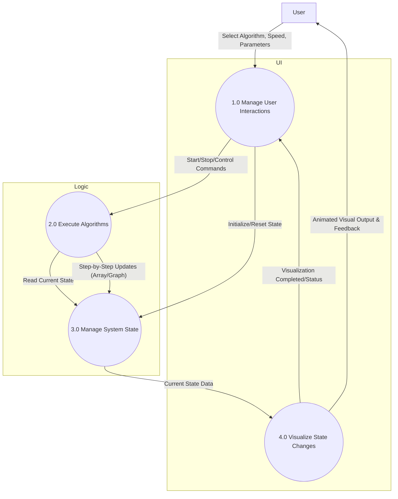
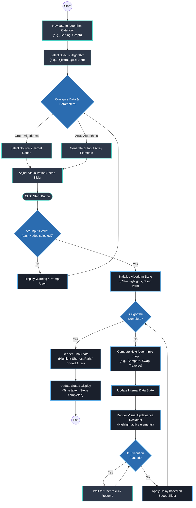

<div align="center">


# AlgoScope

**A modern, interactive algorithm visualizer that demystifies complex logic through real-time, high-fidelity animations.**

[](https://react.dev/)
[](https://nodejs.org/)
[](https://vitejs.dev/)
[](https://tailwindcss.com/)
[](LICENSE)
[](CONTRIBUTING.md)
[](https://gssoc.girlscript.tech/)
[](https://hub.docker.com/r/bimbok/algoscope-app)
[](https://discord.gg/xxFRGj82xS)

Join our community for updates and support!

### 🌐 Live Demo

Experience AlgoScope in your browser: **[algo-scope-virid.vercel.app](https://algo-scope-virid.vercel.app)**

### Core Maintainers

<table>
       <tr>
              <td align="center" style="padding: 6px 18px;">
                     <a href="https://github.com/adityapaul26">
                            
                     </a>
                     <br />
                     <a href="https://github.com/adityapaul26"><strong>@adityapaul26</strong></a>
                     <br />
                     <a href="https://github.com/adityapaul26">
                            
                     </a>
              </td>
              <td align="center" style="padding: 6px 18px;">
                     <a href="https://github.com/Bimbok">
                            
                     </a>
                     <br />
                     <a href="https://github.com/Bimbok"><strong>@Bimbok</strong></a>
                     <br />
                     <a href="https://github.com/Bimbok">
                            
                     </a>
              </td>
       </tr>
</table>

<sub>Click a profile or follow badge for updates and to connect with the team.</sub>

</div>

---

## 💡 Project Purpose

Learning Data Structures and Algorithms (DSA) is often a daunting task for students and developers. Traditional resources like static pseudocode and textbooks fail to capture the dynamic nature of algorithms.

**AlgoScope** bridges this gap by providing a hands-on environment where users can watch the flow behind every operation. By transforming abstract logic into fluid animations, AlgoScope helps users build a mental model of how algorithms actually work, making the learning process intuitive, engaging, and accessible.

---

## ✨ Features

| Feature                     | Description                                                                                                                                     |
| --------------------------- | ----------------------------------------------------------------------------------------------------------------------------------------------- |
| **Real-time Visualization** | Watch algorithms come alive with smooth, step-by-step animations using Framer Motion and Anime.js.                                              |
| **Adjustable Speed**        | Full control over animation speed with +/- precision buttons and input data to learn at your own pace.                                          |
| **Algorithm Coverage**      | Support for Sorting (Quick, Merge, Shell), Searching (Linear, Binary), Graph (BFS, DFS, Dijkstra), and Dynamic Programming (Kadane's, Moore's). |
| **Comparison Mode**         | Side-by-side visualization of multiple algorithms to compare their efficiency and execution patterns in real-time.               |
| **Code Insights**           | See implementations in C++, Java, Python, and JS with a multi-language viewer and one-click copy functionality.                                 |
| **Complexity Analysis**     | Interactive performance graphs and complexity cards to visualize Big O notations and scaling behavior.                                          |
| **URL Persistence**         | Shareable links that preserve the current algorithm state and parameters using URL search params.                                               |
| **Interactive Playground**  | Create custom inputs, change array sizes, and interact directly with the canvas.                                                                |
| **Secure & Modern UI**      | Dark-themed interface built with Tailwind CSS v4, featuring Clerk authentication and modal-based search.                                        |

---

## 🛠️ Tech Stack

### Frontend

- **Framework:** [React 19](https://react.dev/)
- **Authentication:** [Clerk](https://clerk.com/)
- **Build Tool:** [Vite 7](https://vitejs.dev/)
- **Styling:** [Tailwind CSS v4](https://tailwindcss.com/)
- **Animations:** [Framer Motion](https://www.framer.com/motion/), [Anime.js](https://animejs.com/)
- **Routing:** [React Router v7](https://reactrouter.com/)

### Backend

- **Runtime:** [Node.js](https://nodejs.org/)
- **Framework:** [Express](https://expressjs.com/)

### Utilities

- **Syntax Highlighting:** [React Syntax Highlighter](https://github.com/react-syntax-highlighter/react-syntax-highlighter)
- **Icons:** Lucide React
- **Charts:** Recharts (Complexity Graphs)

---

## 🚀 Quick Start

Follow these steps to set up AlgoScope locally on a clean machine:

### Prerequisites

- [Node.js](https://nodejs.org/) (v18.x or higher)
- [npm](https://www.npmjs.com/) or [yarn](https://yarnpkg.com/)

### Setup Steps

```bash
# 1. Clone the repository
git clone https://github.com/algoscope-hq/AlgoScope.git
cd AlgoScope

# 2. Install dependencies
npm install

# 3. Configure Environment Variables
# Create a .env file from the example
cp .env.example .env
# Open .env and add your VITE_CLERK_PUBLISHABLE_KEY from Clerk Dashboard

# 4. Start the development server
npm run dev
```

Open `http://localhost:5173/` in your browser to start exploring.

### Docker Quick Start

If you have Docker installed, you can pull and run the pre-built image:

```bash
# 1. Pull the image
docker pull bimbok/algoscope-app:latest

# 2. Run the container
docker run -d -p 8080:80 bimbok/algoscope-app:latest
```

Access the app at `http://localhost:8080`.

---

## 🏗️ Architecture

AlgoScope uses a component-based architecture where each algorithm category has its own specialized visualizer:

```text
api/
├── index.js               # Backend entry point (Express)
└── vercel.json            # Vercel deployment configuration
src/
├── algorithms/
│   ├── kadane/            # Kadane's Algorithm step generator
│   ├── mooreVoting/       # Moore Voting Algorithm step generator
│   ├── searching/         # Search and shortest-path step generators/source data
│   └── sorting/           # Sorting algorithm step generators
├── assets/                # Static images and icons
├── components/
│   ├── about/             # About page cards and sections
│   ├── arraySearch/       # Linear and binary search visualizers
│   ├── dataStructures/    # Stack, queue, and tree visualizers
│   ├── kadaneAlgo/        # Kadane's Algorithm visualizers
│   ├── mooreVotingAlgo/   # Moore Voting Algorithm visualizers
│   ├── searchAlgo/        # Graph traversal visualizers and controls
│   ├── shortestPathAlgo/  # Shortest-path visualizers and controls
│   ├── sortingAlgo/       # Sorting visualizers
│   └── visualizer/        # Shared code panel and playback helpers
├── App.jsx                # Main routing and global state management
├── App.css                # App-level styles
├── input.css              # Tailwind entry styles
└── main.jsx               # React entry point
```

### How It Works

1. **State Management:** React state tracks the current progress of the algorithm (e.g., current indices being compared).
2. **Animation Engine:** Framer Motion and Anime.js handle the transitions based on state changes.
3. **Pseudo-code Sync:** The `CodeDisplay` component highlights lines of code in real-time as the algorithm executes.

### System Data Flow



### User Workflow & Execution Logic



---

## Star History

<a href="https://www.star-history.com/?repos=algoscope-hq%2FAlgoScope&type=timeline&legend=bottom-right">
 <picture>
   <source media="(prefers-color-scheme: dark)" srcset="https://api.star-history.com/chart?repos=algoscope-hq/AlgoScope&type=timeline&theme=dark&legend=bottom-right" />
   <source media="(prefers-color-scheme: light)" srcset="https://api.star-history.com/chart?repos=algoscope-hq/AlgoScope&type=timeline&legend=bottom-right" />
   
 </picture>
</a>

---

## 🤝 Contributing

We welcome contributions! Whether it's a bug fix, a new algorithm visualization, or a UI improvement, your help is appreciated.

1. **Fork the repo** and create your branch from `main`.
2. **Setup locally** following the [Quick Start](#-quick-start) guide.
3. **Commit your changes** with descriptive messages.
4. **Open a Pull Request** and describe your changes in detail.

## _For more detailed guidelines, please refer to our [Contribution Guidelines](CONTRIBUTING.md) and [Code of Conduct](CODE_OF_CONDUCT.md)._

---

## ✨ Contributors

Thanks goes to these wonderful people who have contributed to AlgoScope:

<a href="https://github.com/algoscope-hq/AlgoScope/graphs/contributors">
  
</a>

---

## 📞 Contact

If you have any questions or want to discuss a contribution, feel free to reach out:

- **Discord:** [Join our community](https://discord.gg/xxFRGj82xS) (Real-time discussion & support)
- **Primary Channel:** [GitHub Issues](https://github.com/algoscope-hq/AlgoScope/issues) (Best for bug reports and feature requests)
- **Aditya Paul:** [LinkedIn](https://linkedin.com/in/aditya-paul-b8881a31b/)
- **Bratik Mukherjee:** [LinkedIn](https://linkedin.com/in/bratik-mukherjee)

---

## 📄 License

Released under the [MIT License](LICENSE).

<p align="center">Made with ❤️ for the DSA community.</p>
